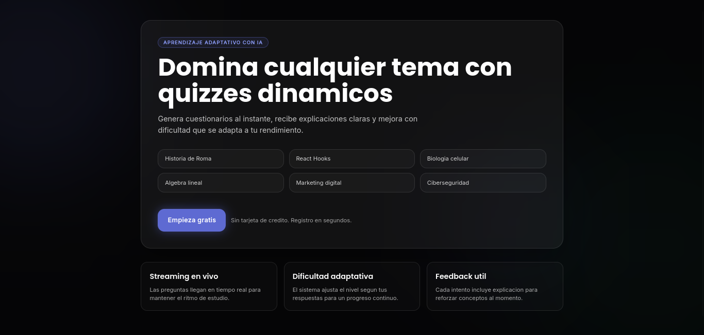
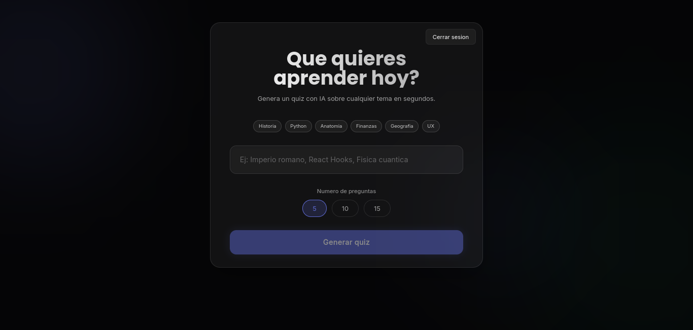
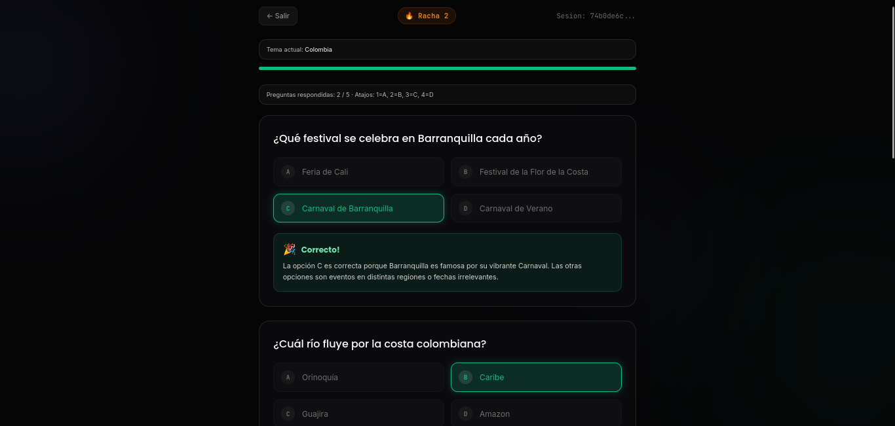

<div align="center">
  
  # 🧠 QuizDinamico AI
  
  **Aprende cualquier tema al instante con IA y dificultad adaptativa.**

  <p>
    <a href="#-sobre-el-proyecto">Proyecto</a> •
    <a href="#-beneficios-clave">Beneficios</a> •
    <a href="#-tecnologías">Tecnologías</a> •
    <a href="#-desarrollo-local">Uso Local</a>
  </p>
</div>

---

## 🚀 Sobre el proyecto

**QuizDinamico AI** es una plataforma educativa de nueva generación. En lugar de cuestionarios estáticos, utiliza Modelos de Lenguaje (LLMs) para generar preguntas en **tiempo real** sobre absolutamente cualquier tema que elijas. 

Gracias a una conexión de datos directa (Server-Sent Events), las preguntas aparecen al instante en pantalla con un efecto máquina de escribir, sin tener que esperar a que la IA procese toda la ronda. Además, el sistema **gamifica tu aprendizaje** ajustando la dificultad automáticamente según tus rachas y aciertos.

<br>

## 📸 Pantallas y Demo

| Pantalla de Inicio | Dashboard de Consultas | Cuestionario en Acción |
| :---: | :---: | :---: |
|  |  |  |

<br>

## ✨ Beneficios Clave

- ⚡ **Velocidad Extrema (Streaming NDJSON):** No hay pantallas de carga infinitas. Recibes la pregunta y sus opciones apenas el cerebro de la IA empieza a pensar.
- 🎯 **Dificultad Inteligente:** Si aciertas, te reta con nivel *Difícil*. Si fallas, ajusta a *Fácil*. Estudia a tu propio ritmo.
- 💬 **Explicaciones Detalladas:** Aprenderás por qué te equivocaste. Cada respuesta revela los detalles del concepto evaluado.
- 🔥 **Sistema de Gamificación:** Celebraremos tus logros. Rachas, contadores dinámicos y confeti cuando apruebas rondas complejas.
- 🛡️ **Resiliencia Multi-Proveedor:** Utiliza OpenRouter como cerebro primario y Cerebras como modelo de respaldo para asegurar que el sistema nunca caiga.

<br>

## 🛠 Tecnologías

QuizDinamico AI es un monorepo administrado mediante **pnpm workspaces**.

*   **Frontend:** React 18, Vite 5, Tailwind CSS v4.
*   **Backend:** Node.js 20, Express 5, TypeScript.
*   **Persistencia:** PostgreSQL gestionado a través de **Prisma**.
*   **Contratos:** Zod (validación de datos end-to-end entre Front y Back).
*   **Despliegue:** Docker multi-stage optimizado para Dokploy/CubePath.

<br>

## ⚙️ Desarrollo Local

Arrancar este proyecto en tu máquina local es extremadamente sencillo. 

### Prerrequisitos
- Node.js `v20` o superior.
- `pnpm` versión 9.
- PostgreSQL (Instalado localmente o mediante Docker Compose).

### PASO 1. Instalación
Clona el repositorio e instala las dependencias del monorepo:

```bash
git clone https://github.com/tu-usuario/quiz-dinamico.git
cd quiz-dinamico
pnpm install
```

### PASO 2. Variables de Entorno
Dirígete a la carpeta del backend y configura tus credenciales creando un archivo `.env`:

```bash
cp apps/backend/.env.example apps/backend/.env
```
Asegúrate de rellenar:
- `DATABASE_URL`: Tu cadena de conexión de PostgreSQL.
- `JWT_ACCESS_SECRET` y `JWT_REFRESH_SECRET`: Claves seguras para la autenticación.
- `OPENROUTER_API_KEY`: Tu token para la IA generativa.

### PASO 3. Base de Datos
Empuja los esquemas a tu base de datos mediante Prisma:

```bash
pnpm --filter backend prisma:push
```

### PASO 4. Arrancar
Usa el poder de pnpm para levantar Front y Back al mismo tiempo. En dos terminales distintas ejecuta:

```bash
# Terminal 1 - Backend (http://localhost:3000)
pnpm --filter backend dev

# Terminal 2 - Frontend (http://localhost:5173)
pnpm --filter frontend dev
```

> **¡Listo!** Abre tu navegador en `http://localhost:5173` y empieza a estudiar inteligente.

<br>

## 🚨 Solución de Problemas (Troubleshooting)

### Error 429: "temporarily rate-limited upstream"
Si al generar cuestionarios recibes este error, significa que el modelo gratuito que estás usando en OpenRouter se ha saturado por demanda de muchos usuarios.

**¿Cómo mitigarlo?**
El sistema está diseñado para ser resiliente. Si esto ocurre, modifica tus variables de entorno en `apps/backend/.env` con alguna de estas tres soluciones:

1. **(Recomendado) Activar el Fallback Ultra-Rápido:** Crea una cuenta gratuita en [Cerebras](https://cloud.cerebras.ai/) y agrega tu API Key. Si OpenRouter cae, Cerebras generará las preguntas automáticamente sin que el flujo del usuario se rompa:
   ```env
   CEREBRAS_API_KEY="tu-api-key-aqui"
   ```

2. **Cambiar el modelo primario o de respaldo:** Configura las variables para apuntar a un modelo distinto de la capa gratuita menos saturado, o a uno de pago (si posees créditos):
   ```env
   OPENROUTER_MODEL_FALLBACK="meta-llama/llama-3.1-8b-instruct:free"
   # o
   OPENROUTER_MODEL_PRIMARY="google/gemini-2.5-flash-lite-preview"
   ```

3. **Inyectar créditos en OpenRouter:** Con apenas cargar unos pocos céntimos, los límites "rate-limit" (`429`) se expanden enormemente y este error prácticamente desaparece.

<br>